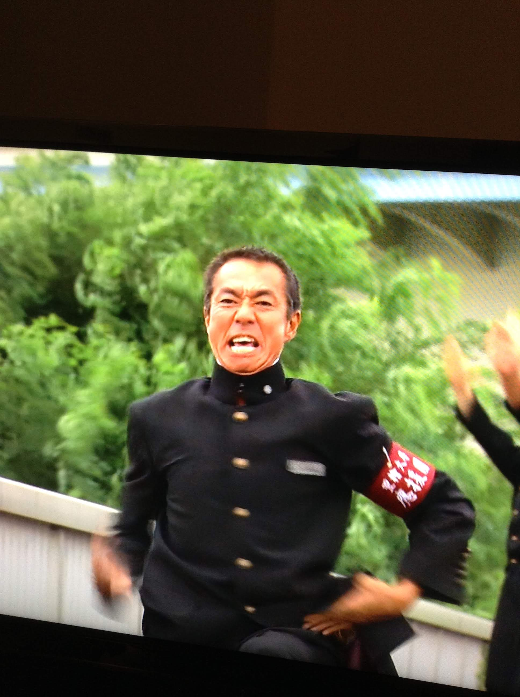
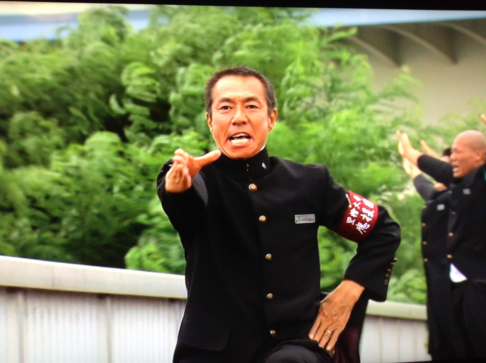
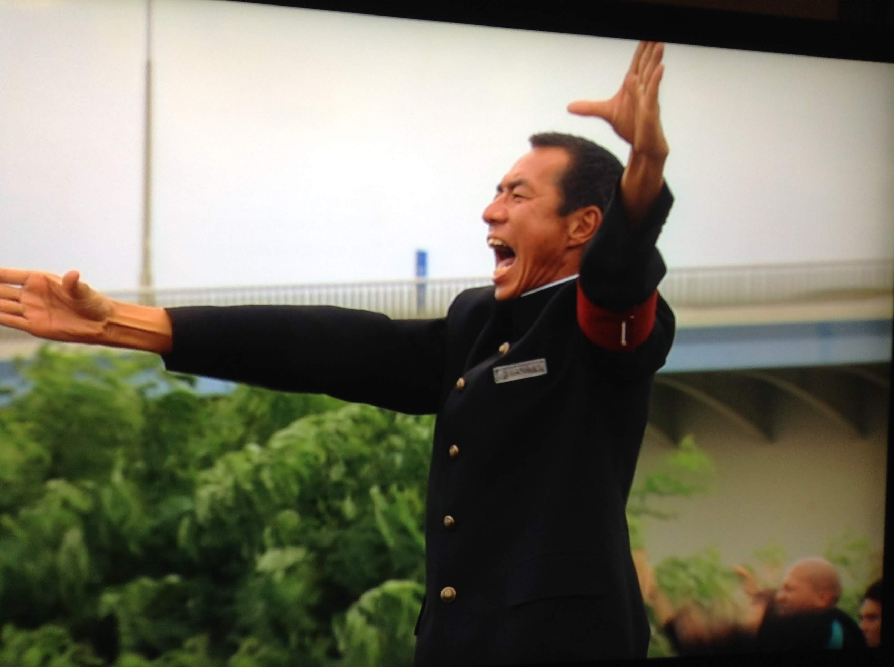

# yoshi
<html lang="ja">
 <head>
  <meta charset="utf-8" />
 

<link href="https://cdnjs.cloudflare.com/ajax/libs/lightbox2/2.7.1/css/lightbox.css" rel="stylesheet">
   
</head>
<!--
<body onload="alert('2010年同期会の記録〜〜(^o^)/')" onunload="alert('再会の時まで、元気でお過ごしくださいませ〜(^o^)/')">
-->

  モバイル端末をお使いの場合は、画面を横向きにするとより見やすくご覧頂けます。

<h1><marquee behavior="alternate">!!! あの頃。そしてカミングアウト 吉田紀子 !!!</marquee></h1>

<a href="https://torokoid.github.io/home">Home</a>>あの頃。そしてカミングアウト

                              
<!--

 アクセス用QRコード

<marquee direction="right" scrollamount="20" width="30%">(^_^)/~hada</marquee>

<h2><marquee behavior="alternate">!!! 2019年6月1日、還暦祝い@池袋 !!!</marquee></h2>
-->

<main>

  
増子さま  

添付は、大泉応援団の事を書いた拙文です。  

以下のコメントを、文章の前につけていただけると、どんな状況で
書いたのかわかるかと思いますので、これもつけていただければと。 
↓  

 

大泉３０期の皆さまへ  

還暦同窓会！　最高でした。 
幹事の皆さん、こんな会を開いてくれて本当にありがとうございました。  

家に戻り、大泉時代の事が走馬灯のように蘇り、高校時代のことを書
いた拙文があったことを思い出しました。  

これは、２０１４年にフジテレビで、地味～に書いて地味～に終わって
しまった自分史上初の打ち切り番組（きっと誰も見ていないと思う(^^;） 
重松清氏原作の連ドラ（出演・柳葉敏郎・反町隆史・ほんこん・風間俊
介・剛力彩芽他）「あすなろ三三七拍子」の最終話執筆の前にスタッフ
に向けて書いた個人的な文章です。  

応援団の事、体育祭のことなどが書いてありますので、よかったら読ん
でみてください。高校時代の事が再び蘇るかも？デス。  

「あすなろ三三七拍子」低視聴率につき、DVDは出ていないのですが、
原作はすごく面白いです。 
そして、ドラマもコアなファンがいてくれて、打ち切り反対運動まで出てく
れた愛しすぎるドラマなのでした。 
柳葉さん扮する主人公の中年サラリーマンが、なぜか廃部寸前の世田
谷商業大学の応援団に出向させられ、学生たちとともに、応援団を存続
する話です。  

そして、なぜ私にオファーが来たのかわからないのですが、書くことになり
高校時代応援団だったことを恥ずかしくて言えずに、最終話まで来てしま
い、カミングアウトした手紙のようなものなのでした。  
 

　２０１９年・６月　吉田紀子 
 

  </main>

   
<!--
<section>
 
  
 　【あの頃。そしてカミングアウト】  
<!--
　これまで､皆さんに言おうか言わまいか…。ずっと迷っていたというか､隠していたことがあります。押忍。最終話にむけ、気持ちを整理する意味もあり、ここにカミングアウトします。 
　今の私からは想像できないかも知れませんが、実は私、高校時代三年間、応援団におりました。しかも、三年生の時は、赤組女子応援団長。旗手として、赤い団旗を掲げ、もちろん､エールもきっていましたし、学ラン着て、長いはちまきなびかせ、扇で三三七拍子もやったし、そうそう、空手の型もあって、押忍！　も、言っていたなあ。 
　吉田一七歳。若かった…。  
<!--
　私の出身高校は、都立の大泉高校というところ。東京練馬区の外れにある校庭が都内の高校の中で一番広いということだけが自慢の､東京にありながら自然溢れる、のびのびとした校風の高校でした。あの頃の都立高校には、制服もなければ､髪型も自由。なのに、なぜか、バンカラ男子校時代（旧制中学）のなごりで、体育祭の時は､応援団が結成されるのです。期間は、春休み（新入生は四月）から､五月下旬の体育祭本番までの三ヶ月弱。でもこの応援団が、結構本格的で、伝統のエールが数種類あったり、校友の歌の振り付けがあったり、応援団に代々伝わる替え歌があったり､空手の型や、扇の型、覚えること満載の大変なところでした。 
　クラスで何人か、確か男女三人ずつだったかなあ。体育祭の立て割の赤青白組（この三組で体育祭を競うのです）の応援団の希望者を募ります。もちろん、私は､応援団なんてものに､入る気持ちはさらさらなかったのです。なのに､クラスで一番仲の良かった友人が、ねえ一緒に入ろうよ。入ろうよ……。と、あまりにも誘うので、入ってしまった。 
　それが､運のつき。応援団男子は、ほぼ全員が、硬派の柔道部剣道部員､女子は有志。練習も厳しく、朝練昼練、放課後。五月に入ると連休も土日もなく毎日。そうだ、大学生の柔剣道部のＯＢもよく来て、「よしだ～ニヤニヤするんじゃない！」と､怒鳴られたこともあったっけ。 
　興味本位で、なんとなくフレーフレーとやっていた一年生。それなりに体育祭も楽しかった。コスプレしたり､ポンポンふってチアの真似事したり、エールも覚えたし。思い切り声だすのってスッキリするなとも思った。でも、先輩達のうしろで､間違えないようにやっていただけ。二年になったら、辞めるつもりだったのに。二年生の春だったか、一年の三学期の終わり頃だったか。なぜか柔剣道部の男子に囲まれ、「団員足りないんだ。頼む。今年もやってくれ」と言われた。「え」「今年はちょっと……。もういいよ」「頼む」。断れずに二年生もやった。 
　赤組応援団。後輩も入り、だらだらもできず、ちょっと指導する立場。その時の女子応援団長（男女別々に団長がいる）の先輩がめちゃカッコよかった。足が長くて、顔小さくて、硬派で。女心に惚れた。「よしだ、二年のまとめは頼むよ」なんかそんなこと言われた記憶が。「押忍」そのあたりから、本気になった。 
　屋上や中庭での練習。繰り返し繰り返しエールをきったこと、今も憶えている。というか、この話を書き出してから、鮮烈に思い出した。できるまで、できても型が美しくなるまで。体を弓なりに反らせて、空に向い声を届かせる。声は出せば出すほど、出るようになる。アホみたいに夢中になった。 
　体育祭。気合はいりまくって応援。応援団の見せ場は、沢山あった。開会式。エール交換と校友の歌。競技中の応援。各競技の合間のデモンストレーション。男子団長は、出初め式みたいな高いハシゴの上にのぼり、そこで扇で一拍子から三三七拍子まで。女子も扇もって拍子とった。そうだ､私、扇の時、笛吹いてました。ピーッピ。ピッピッピッ！　太鼓ドーンみたいな。（太鼓は誰が叩いていたんだっけ。やはり応援団だったのかな）この笛の切れが悪いと拍子がしまらないので、結構練習したなあ。先輩に特訓受けた気もする。空手。校歌。そして、閉会式。体育祭が終わると､打ち上げ、高校生なのに酒飲んで号泣。解団式で、校友の歌を歌い、また皆で泣いた。ははは。 
　三年生になった頃には、「お前、赤組女子団長頼むな」｢押忍｣みたいな感じ。当然のごとく皆を仕切った…この私が。人間やればできる。私を知る周囲の友人達は、「どうしたのあんた」「どうなってるの」的な目。鬼団長でしたよ。まるで、駒澤大の彼みたいな。当時つきあっていた同級生の男の子に、「応援団やるならつきあうのやめる」恥ずかしい的なことすら言われ、喧嘩になり、体育祭終わるまで口きかなかったなあ。「別にいいよわかってくれないなら」「でも私やめられないから」みたいな。そういえばその男の子は、体育祭出なかったよ。さぼってたわ。｢絶対、オレは出ない｣とか言っちゃって。今思い出した。よっぽどイヤだったんですね。可哀相に。ああ、青春のほろ苦い思い出たちよ。今ごろ、彼はどんな親父になっているのだろう。 
　体育祭本番。団旗持って、赤組応援団女子を従え、先頭に立った時の誇らしい気持ちは､今も忘れません。まあ、たかだか高校の応援団。たった三ヶ月の練習。それでも、気持ちがピッとひきしまったなあ。（その後、二十歳を過ぎて、富良野塾という体育会よりも体育会な厳しいクリエイティブ集団に入るわけですが…。ここの厳しさは､想像を絶します。高校応援団なんて、、へみたいなもんですわ）  
<!--
　今、最終話を前に。私はどんな気持ちで応援をしていたのだろう。と、考えています。十代だったし､子供だったし。誰かのためにという思いより前に、最初は、皆に遅れないように間違えてはいけない。から始まり、団長になったらなったで、エールは美しくあらねばならないとか、一糸乱れぬものでなければいけないとか。本気でやらないやつは許せない。みたいな気持ちで、やっていただけだった気がするなあ。熱いな、自分。 
　誰かを応援したいとか（応援することは前提となっていたので）応援が誰かの心に届くのかなんてことは考えず、そう、とにかくただひたすら、ちゃんとした応援をしたい。それだけだった気がします。ひたすら。これはよくわかる。応援するときの気持ち。 
　声を届かせるのに､相手とか考えない。ただ宙にむかって（小林宙さんではないです。念のため）叫ぶ。祈る。気を送る。無になる。そんな感じ。（６話で祈り出てきましたね。わかるとてもよく） 
　ひたすら､自分との闘いだったのかなあ。好きな男の子に嫌われてまでやっていた訳だから。あとは責任感。体育祭を成功させなければならないという。
　体育祭を終えたあとの涙は、懸命に何かを成し遂げたあとの達成感の涙で。なんか柔剣道部のいかつい奴らも、みんな泣いていたな。間違いなくほぼ全員。アホみたいに。  
<!--
　体育祭のあとの、だだっ広い高校の校庭。夕日。消えかかった陸上サークルの白線。　紙吹雪や紙テープのあと。マスコット部隊がつくった高さ五メートルはある、巨大な、はりぼて人形。 
　ほこりっぽい校庭で、みんなで泣きながら、順番に胴上げとかして。あの頃はやっていた「電線音頭」を狂ったように、日が暮れるまで踊ったっけ。 
　そんな応援団は､一般の生徒からは冷たい目で見られていた。おそらく絶対に。自分たち、 
全然気づいていなかったけど。それこそ、自己満足の、その当時でさえ時代錯誤なヘンテコ集団の応援団が、自分たちで作り上げたカタルシス。祭り。 
　体育祭が終わったあとは、なんだか気が抜けちゃって。そうそう。廊下で団員に会うと､どちらからともなく涙目になったりして。淋しくなって、しばらくは時々みんなで石神井公園に集まって、ＯＢまで来て、なぜか知らないけど、“だるまさんが転んだ”（応援団の伝統）を、みんなでやったりして。あれは一体何だったのだろう。 
　でも、そこには、確かに何かがあった。それって何だったんだろう。  
<!--
　あのカタルシスがもしかしたら、私がその後、全然形は違うけれど､シナリオを書き始め、 
ドラマというお祭りの中に身を投じようと思った始まりなのかも知れない。 
　なぜドラマを書くのか。特に連ドラ執筆は、とにかくひたすら自分との闘い。誰に何を届けるためにとか考える余裕もない。だって視聴者は見えないし。 
　それと同じ問いを､今「応援団」というものに対してするために､このドラマを書いているのかな。  
<!--
　答えはあるのかしら。大介にも私にも。おそらく私は、重松さんのように上手に論理的に応援を語ることができない。なぜなら、当事者だったから。とにかく必死だったから。  
<!--
　でも、何かを必死にやったあとに残るもの。 
　それがこのドラマの答えなのかもしれない。 
　だから、もしかしたらもっと武骨な言葉しか出てこないのかも。 
　いや言葉すらなく、ただ涙しか出ないのかも。 
　そんなことを思いつつ。 
　　　　　　　　　最終話を前に　吉田紀子  
<!--
　あ。今また思い出しました。三年の秋、勝ち進んだ野球部の予選、応援に行ったわ。そうそう、急遽応援団、呼び出されて。で､堀越学園と闘ってコールド負けだったなあ。国立の方の球場だったような気がする。 
 
<!--
  

   </section>
<!--
 
<a href="https://torokoid.github.io/yoshi/blob/master/あの頃%E3%80%82そしてカミングアウト.pdf">ご本人からの原文リンク(改行位置保持)</a>
-->

<strong> 
<a href="http://norikoyoshida.jp" class="p">Profile</a>クリックでProfileに飛びます。 戻るにはブラウザの戻るボタンで！ 
</strong>

                   
<!--
<section>
<!-- begin wwww.htmlcommentbox.com -->
<!--

<a href="http://www.htmlcommentbox.com">HTML Comment Box</a> is loading comments...

 <link rel="stylesheet" type="text/css" href="//www.htmlcommentbox.com/static/skins/bootstrap/twitter-bootstrap.css?v=0" />
 -->
<!-- end www.htmlcommentbox.com -->
<!--
</section>
-->

                             
          

<a href="https://torokoid.github.io/oizumi">大泉高校30期のHP　← リンクあり</a>

  

 

<!-- フッタ -->
 <footer>
 Copyright 2019/06/05 Pe-Young(S.Hada)
 </footer>
